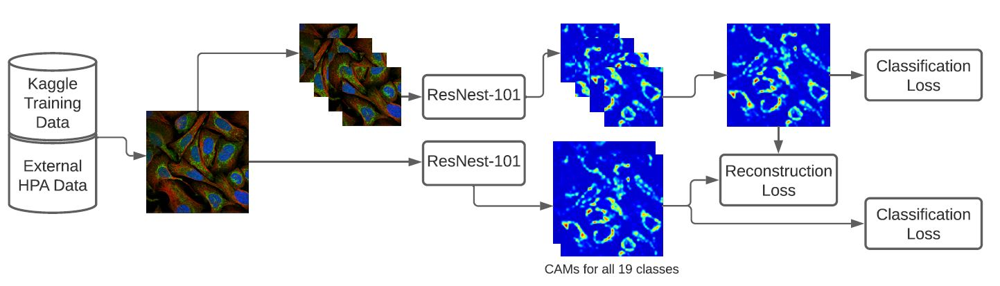
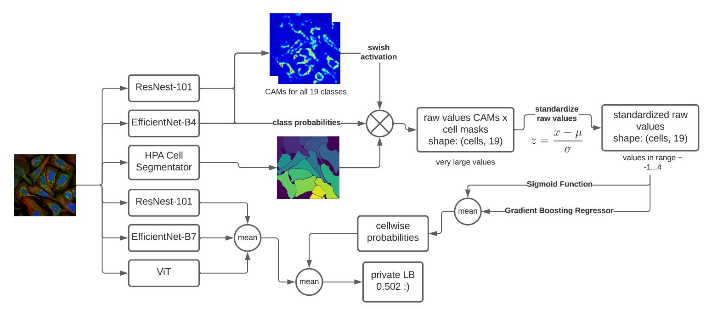

# HPA Single Cell Classification Place 21 Solution

This is my solution for the  [Kaggle HPA Cell Classification Challenge 2021](https://www.kaggle.com/c/hpa-single-cell-image-classification/overview)  
I'm verry happy to get my first silver medal on Kaggle and want to share my approach with you.

And thanks to [phalanx](https://www.kaggle.com/c/hpa-single-cell-image-classification/discussion/217395) and his post on Puzzle-CAM for good inspiration.  
Cheers also to  Sanghyun Jo and In-Jae Yu for their publication on [Puzzle-CAM](https://arxiv.org/abs/2101.11253). 
If this approach is not familiar to you, you find informations in the paper

## General Approach
Like many of you, I read a lot a weakly-labeled instance segmentation and eventually wanted to go for a image-level training and inferencing method.
For this to achieve, a model producing good Class-Activation-Maps was needed so I decided to try Puzzle-CAM and do some mapping magic for inferencing to get 
probabilities from my CAMs.  

***Things I like about this approach:***
1. No single cell segmentation has to be done for training 
2. The more explainable the model is, the better classification results will be made

## Training
I trained according to the Puzzle-CAM paper with each images being tiled to four single images and considering the full-image CAMs versus the tiled-image CAMs in a loss function. 
I used a ResNest-101 and an EfficientNet-B4 with the according GAP Layers added and Focal Loss function.

The following diagram shows the training process for the CAM-Models, exemplary for ResNest-101

## Inferencing
Here's the interesting part. I'm simply multiplying the CAM of each class with the cell mask of each cell and the class probability the model produces (using a Swish-Activation to obtain the CAMs gives slightly better results than raw CAMs or ReLU). 
This gives very large class activated values for each class for each cell, which have to be mapped to real class probabilities and I used two approaches for this:  

- standardize the values of each image using sklearn.preprocessing.StandardScaler and applying a sigmoid function to these values (works surprisingly good)
- Do the inferencing on the single-class labeled train data to get the raw values and train a gradient boosting regressor to learn the according label (0..1) for each class 
(to make sure, that the right mapping function, that might be different from the sigmoid function, is found)

In the end I combined both approaches.

The following diagram shows the inferencing process

*remarks on making the code work*
* *Train the Puzzle-CAM models starting here:* `train-cam-model/train_cam.py`  
The models are trained on the [standard data provided by HPA](https://www.kaggle.com/c/hpa-single-cell-image-classification/data) and an additional dataset
containing more data provided by [HPA with only "rare" classes](https://www.kaggle.com/alexanderriedel/hpa-public-768-excl-0-16). Be sure to place these datasets in `train-cam-model/train_data/`
Also carefully check `train-cam-model/config.py` about hyperparameters and models
* *Train the Image-Level-Models starting here:* `rain-image-level-model/train_img.py`  
This script is best run in a Kaggle TPU-Instance as it's TPU-Training and not downloading the image data to a local space but gets them directly from GCS where the Kaggle datasets are stored.

* *Train the Gradient Boosting Regressor starting here:* `train-gradboost-regressor/train_grad_boost.py`  
I'm providing the inferencing CAM-intensity data for every model used in my final submission [here](https://drive.google.com/drive/folders/1BgTjyRnOWYiHnkiZg2MlxQYqWsdN4FeS?usp=sharing) to train the regressor.

* *Inferencing starting here:* `inference/inference.py`  
I'm providing my models via the same link as above. Be sure to figure out paths and everything, this can be painful in python...
